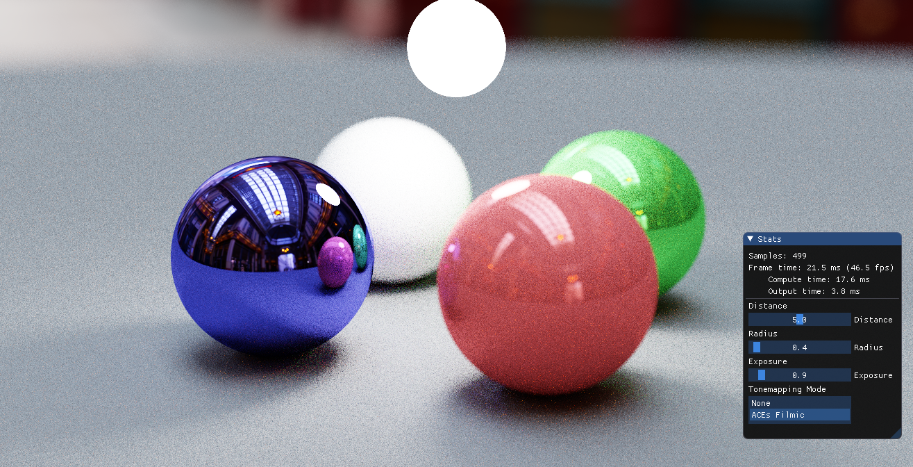

# glpt
Simple Path Tracer using OpenGL Compute Shaders, following [Peter Shirley's Book](http://www.realtimerendering.com/raytracing) and [Alan Wolfe's Blog](https://blog.demofox.org).
## Dependencies
- [dear imgui](https://github.com/ocornut/imgui)
- [stb_image](https://github.com/nothings/stb)
- GLM, SDL, GLEW
## Features
- IBL using Equirectangular HDRIs
- Thin lens depth-of-field
- Basic Tonemapping controls
## TODO
- IBL importance sampling
  - https://developer.nvidia.com/gpugems/gpugems3/part-iii-rendering/chapter-20-gpu-based-importance-sampling
  - https://computergraphics.stackexchange.com/questions/2391/importance-sampling-of-environment-maps
  - https://cseweb.ucsd.edu/~ravir/papers/structured/structured.pdf
- 'Proper' BSDF
- Model Loading & BVH construction (yuck!)
## Screenshots

